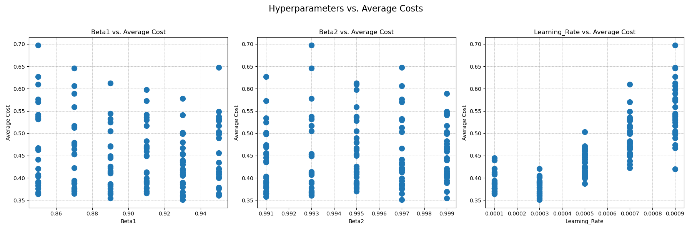
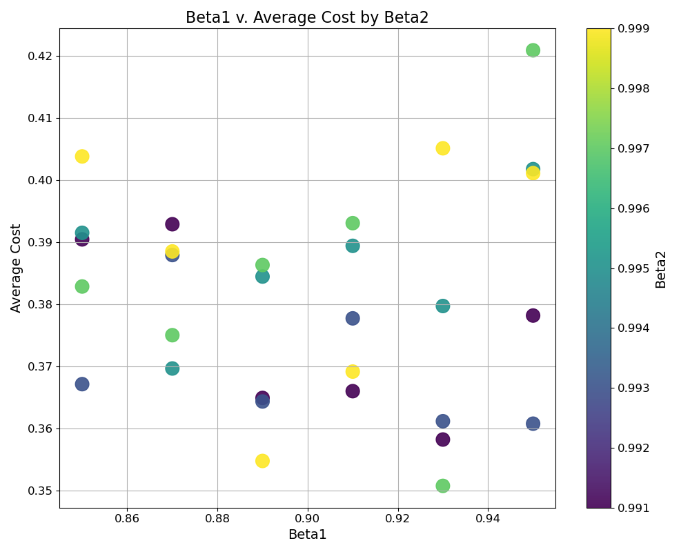
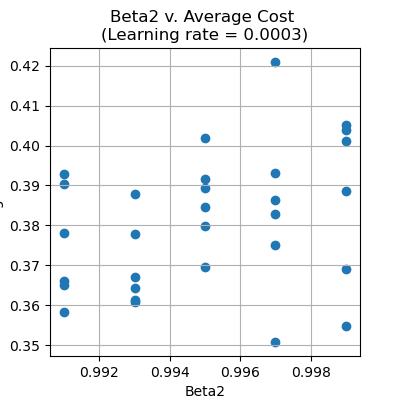
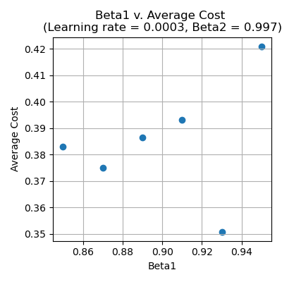

## This project was based on 3Blue1Brown's neural network series.

The example network he uses is an MLP containing 4 layers - 2 hidden layers with 16 neurons each. It predicts the digits shown in a 28 x 28 images of peoples' handwriting, so the input and output layer each have 784 and 10 neurons. This project is that example brought to life.

To sum up his video series, a neural network is a large function that uses large matrix operations and differentiable activation functions. In training, it uses derivatives to find in what direction its parameters must shift to bring its outputs as close to the ideal outputs as possible. 

## Summary
This exact model has 4 layers.

  - **L1** - The input layer, with 784 neurons so it can accept flattened and vectorized 28 x 28 images.
  - **L2 / L3** - Hidden layers with 16 neurons each and ReLU activation. 
  - **L4** - Output layer with 10 neurons, each representing a digit. SoftMax activation.

Parameters are randomly set on instantiation using He initialization. The cost function is Cross Categorical-Entropy (CCE) and gradient steps are calculated with an ADAM optimizer. 

Optimized default hyperparameters can be found here. These were used to train the current saved model, which has a 95.11% raw accuracy and ~0.224 cost.

## How to use
There are three modules for users to run.
#### run_interactive.py
The most user-friendly - loads the saved model, displays random entries from the testing set, and makes predictions on those entries. Human users can test their accuracy against the machine's. 
  - If you delete the default saved model, you must train and save a new one using `run_model.py`.
#### run_model.py
Instantiates and trains the model.
  - `LOAD_SEED`: if `True`, load the seed and fix parameter initialization.
  - `SEED`: set the seed that `LOAD_SEED` uses.
  - `LOAD_MODEL`: if `True`, load the model in `./_IO/output/model`.
  - `SAVE_MODEL`: if `True`, overwrite the model in  `./_IO/output/model` and save the current model after training.
#### run_tuner.py
For testing purposes only. Iteratively creates 1500 different models using 150 unique hyperparameters and 10 different random seeds each. 
  - The lowest-cost model for each set of hyperparameters, along with the correlated seed and raw accuracy are recorded in `./_IO/output/cost_by_hyperparameter.csv`.

**All hyperparameters and flags** can be edited in `hyperparameters_flags.py`

## Process

Because of my interest in math, I did my best to calculate the derivatives myself and building my network using mostly only NumPy and the data import functions from python-mnist. My math can be found here.

I tried following 3Blue1Brown's example as closely as possible - using ReLU on every layer and Mean Square Error (MSE) as the loss function. However, there were some complications I came across in the process that required me to make some changes:
  - It's unclear how parameters are randomly initialized. **If unbounded, training can be wildly inconsistent and inefficient**. Thus I looked up initialization methods and found **He initialization**, which uses a normal distribution with a standard deviation based on each layer's neuron count.

  - **ReLU has no bounded maximum value**, meaning there are no constant ideal output vectors to compare against the model's predictions. After more searching I used **SoftMax** on the last layer, which was naturally **followed by changing the loss function from MSE to CCE**.
    
  - He's **ambiguous** on **how** and **when** the parameters are updated after calculating the gradients, as well as how we can **avoid getting stuck** in shallow local minima.
      1. I started by shuffling the data between epochs to **introduce stochasity**.
         
      2. I found I could alternatively **use an Exponential Weighted Moving Average (EWMA) to weight gradients based on recency**, instead of a simple raw average. This led me to add one EWMA and rig up what was essentially a RMSProp, but due to being implemented the same way as my raw average, it was **updated on every example and reset after every batch.**
         
      3. My model performance became **incredibly low** (40% accuracy at best), so I went looking for another optimizer and found ADAM. My model still struggled with ADAM.
     
      4. It turned out EWMAs are **NOT an alternative to the raw average** of gradients in a batch; they should **persist even across epochs.** This was the most crucial change that I implemented - average performance shot up to **~85%** raw accuracy after.
   
      5. I was confused on whether EWMA should be updated after each batch or each example. My grad student friend **Rick Chaki** generously informed me that updates happening between examples can be more performant if the batches **have been sorted such that they each contain similar examples.** Because I was shuffling my dataset entirely randomly, I decided to **update it between batches only.**

These challenges demonstrate that **although there are conventions** established for neuron activation and gradient stepping, **the details behind such conventions** are **dependent** on the **context** of the dataset and application.

## Tuning

The hyperparameters I tuned were $\beta_1$ and $\beta_2$ for ADAM and the learning rate. 

All combinations of the following hyperparameters were tested, making 150 unique models:

$\beta_1$ = `{0.85, 0.87, 0.89, 0.91, 0.93, 0.95}`

$\beta_2$ = `{0.991, 0.993, 0.995, 0.997, 0.999}`

`LEARNING_RATE` = `{0.0001, 0.0003, 0.0005, 0.0007, 0.0009}`

Each model was trialled using the same sample of 10 random seeds, totalling 1500 trials. 
Then, the reported cost of each model was averaged across the 10 seeds to get an average cost.  

Only the learning rate initially appears to be related to average cost. Generally, as the learning rate decreases, average cost seems to decrease, but this correlation tapers off as the learning rate shifts from 0.0003 to 0.0001. Let's slice the dataset and look only at points where learning rate = 0.0003 - the cohort that represents the lowest-cost models, since that's what we're interested in.

Now there appears to be a correlation between each of the different $\beta_2$ and the average cost, while $\beta_1$ still has no apparent relation. This is reflected in an ordinary least squares analysis (OLS) of the current slice:

  - The R-squared of average cost to $\beta_1$ and $\beta_2$ is 99.8%,
  - $\beta_2$ has a near-0 p-score and a coefficient of 0.3917,
  - while $\beta_1$ has a p-score of 0.912 and a coefficient of only -0.01.

Thus, $\beta_1$ itself has little to no effect on average cost. However, running another OLS on how learning rate * $\beta_1$ predict average cost reveals a p-score of 0.003 and an R-squared of 71.1%. Therefore, we can conclude the following:
  - The learning rate is the primary predictor of average cost, and an ideal rate for this network is at around 0.0003.
  - $\beta_1$ is highly dependent on the learning rate when predicting cost.
  - $\beta_2$ may be a largely independent predictor of average cost, given a certain learning rate.

Graphing average cost in terms of $\beta_2$ itself for the previously fixed learning rate (LR = 0.0003) shows a slight correlation; as $\beta_2$ decreases, average cost may decrease as well. 

Fixing $\beta_2$ to the value that contains the minimum cost of the dataset and graphing average cost in terms of $\beta_1$ reveals a much stronger relation than before.  

  
  

Thus, 2 sets of hyperparameters are of interest here:
  1. Learning rate = 0.0003, $\beta_1$ = 0.85, $\beta_2$ = 0.997
  2. Learning rate = 0.0003, $\beta_1$ = 0.93, $\beta_2$ = 0.997 - because it had the lowest average cost in the entire set.

## Final notes

Building this project gave me a taste of just how complex project management could be. I started writing this project as quickly as I could without a clear design or the sufficient domain knowledge to know exactly what the end product would look like. 

I found out about EWMAs and ADAM optimizer, and how to update my gradients, as I wrote. I also realized I would need to save, load, and consistently initialize models for testing purposes. These were all functionalities I had not envisioned at first. Implement these unexpected features made my codebase messier and undoubtedly racked up technical debt. For example, there were issues where different modules would make duplicates the same variable, creating state conflicts and preventing the model from training properly.

Such problems led to less-than-ideal design choices, such as putting variables that were relevant to single classes in their modules' global namespaces. 'epoch.py' and 'hyperparameters_flags.py' are in the root directory, when they should be in another directory, separate of the user interfaces. When I attempted refactoring to fix these concerns, my program simply broke.

Another limitation in this project is the lack of testing. I planned to write everything out as soon as possible and test later, but when all was said and done, writing a comprehensive test suite for every single component all by myself seemed nearly impossible within an appopriate timeframe due to the scale and complexity of the final codebase. It became readily apparent how writing tests can be just as difficult, if not more, than writing the code itself, and is certainly much more tedious.

Choosing to use NumPy and analyze each data point sequentially only complicated hyperparameter tuning. I first attempted switching NumPy out for CuPy and renting a GPU-based machine. This caused my model training to slowdown, and I suspect this was due to my program repeatedly transferring arrays to CUDA and using unvectorized data. Unfortunately many of my project components could not accept any-sized matrices, and due to my short foresight when starting this project, adding such a functionality would be akin to rewriting it entirely.

The solution I ended up rigging together used `multiprocessing` to launch 32 different model training processes simultaneously. (I've not included this version of run_tuner, because I'm assuming that most users will not be using 32-core machines). This actually turned out to be a blessing in disguise because my model isn't so compute-heavy in the first place (being an MLP with only 830 neurons in total), so it could still run relatively fast on powerful CPU-based machines, which are much cheaper than GPU machines nowadays.
