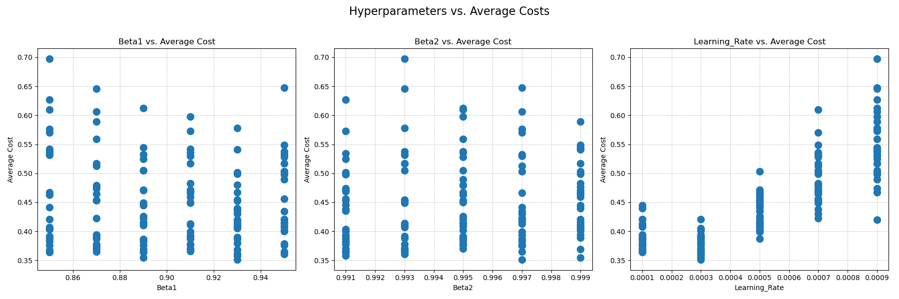
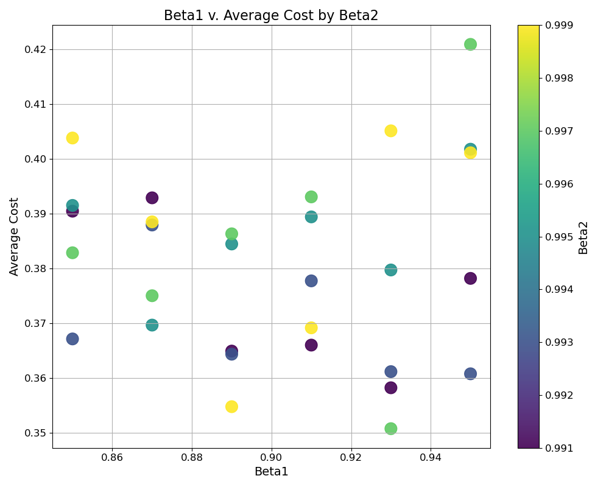
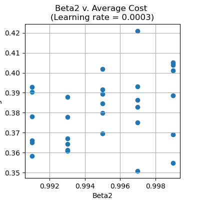
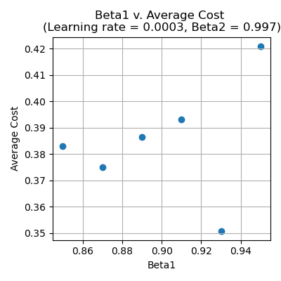

# MNIST Digit Classifier — From-Scratch MLP

Built from [3Blue1Brown's neural network series](https://youtu.be/aircAruvnKk), implemented using only NumPy. Hand-derived backpropagation gradients. **95.11% accuracy, ~0.224 cost.**

## Skills & Frameworks

**Languages:** Python  
**Libraries:** NumPy, pandas, Matplotlib, python-mnist  
**Concepts:** Multilayer perceptron, backpropagation (hand-derived), He initialization, ReLU, SoftMax, cross-categorical entropy (CCE), ADAM optimizer, EWMA, hyperparameter grid search, early stopping, seed-controlled reproducibility, multiprocessing

## Architecture

| Layer | Neurons | Activation |
|-------|---------|------------|
| L1 (input) | 784 | — |
| L2 (hidden) | 16 | ReLU |
| L3 (hidden) | 16 | ReLU |
| L4 (output) | 10 | SoftMax |

- **Initialization:** He (normal distribution scaled by layer width)
- **Loss:** CCE
- **Optimizer:** ADAM with bias correction
- **Early stopping:** patience-based on cost plateau

Default hyperparameters: [EXAMPLE_MODEL.md](./_docs/EXAMPLE_MODEL.md)

## Technical Challenges & Solutions

1. **Unbounded random init caused inconsistent training.** Solved with He initialization — normal distribution with std dev scaled to neuron count per layer.

2. **ReLU on the output layer has no bounded max, so no stable target vectors exist.** Switched the output layer to SoftMax and replaced MSE with CCE accordingly.

3. **EWMA persistence bug:** Initially reset momentum/variance EWMAs after each batch (same lifecycle as the raw gradient average). Training capped at ~40% accuracy. Fixing EWMAs to persist across batches and epochs immediately jumped accuracy to ~85% — the single highest-impact fix.

4. **EWMA update granularity:** Chose per-batch updates over per-example because the dataset is shuffled randomly (no intra-batch similarity to exploit).

5. **CuPy/GPU attempt failed** — repeated host-to-device transfers on unvectorized, single-example forward passes negated GPU gains. The architecture doesn't support batched matrix ops without a rewrite. Solved with `multiprocessing` (32 parallel training processes) instead.

## Hyperparameter Tuning

Grid search over ADAM's $\beta_1$, $\beta_2$, and learning rate — 150 unique configurations, 10 seeds each (1,500 total trials).

$\beta_1$ = `{0.85, 0.87, 0.89, 0.91, 0.93, 0.95}`  
$\beta_2$ = `{0.991, 0.993, 0.995, 0.997, 0.999}`  
`learning_rate` = `{0.0001, 0.0003, 0.0005, 0.0007, 0.0009}`

**Key findings (OLS regression on the LR=0.0003 slice):**
- Learning rate is the dominant predictor of cost. Optimal value: ~0.0003.
- $\beta_2$ is a significant independent predictor (p ~ 0, coefficient 0.39, R-squared 99.8% jointly).
- $\beta_1$ alone has no significant effect (p = 0.912) but interacts with learning rate (p = 0.003, R-squared 71.1%).

  
  

**Optimal hyperparameters:** LR = 0.0003, $\beta_1$ = 0.93, $\beta_2$ = 0.997 (lowest average cost across all trials).

## Usage

| Module | Purpose |
|--------|---------|
| `run_interactive.py` | Load saved model, predict random test images, compare human vs. machine accuracy |
| `run_model.py` | Train a new model (flags: `LOAD_SEED`, `LOAD_MODEL`, `SAVE_MODEL`) |
| `run_tuner.py` | Grid search over 1,500 hyperparameter/seed combinations |

All flags and hyperparameters are configured in `hyperparameters_flags.py`.

## Reflections

- **Testing debt:** Deferred unit tests during rapid prototyping. Retrofitting a comprehensive suite onto a tightly coupled codebase proved impractical — reinforced the value of test-first development.
- **Architecture rigidity:** Single-example forward passes made GPU acceleration and batched operations impossible without a full rewrite. Better upfront design of the data pipeline would have avoided this.
