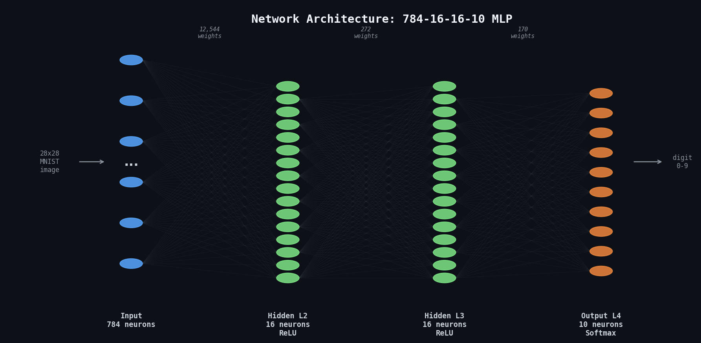
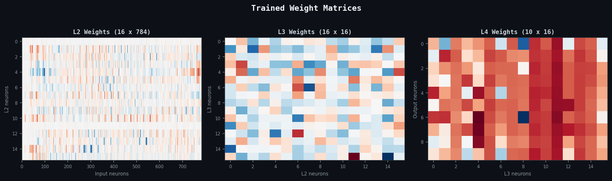
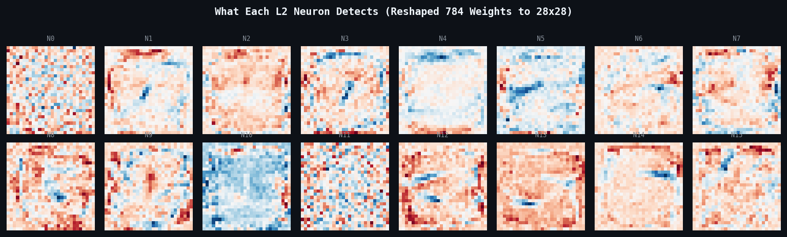

# Handwritten Digit Classifier -- Built from Scratch with NumPy

A 4-layer MLP that classifies handwritten digits from the MNIST dataset, achieving **95.11% accuracy**. No PyTorch, no TensorFlow -- just NumPy, calculus, and a lot of debugging.

[](https://youtu.be/aircAruvnKk)

This project is the example neural network from [3Blue1Brown's neural network series](https://youtu.be/aircAruvnKk) brought to life. He walks through a 784-16-16-10 MLP that reads 28x28 images of handwritten digits and predicts what number they show. I built it from the ground up -- forward pass, backpropagation, ADAM optimizer, hyperparameter tuning -- all implemented manually.

## Architecture

<p align="center">

</p>

- **L1 (Input)** -- 784 neurons accepting flattened 28x28 MNIST images
- **L2, L3 (Hidden)** -- 16 neurons each, **ReLU** activation
- **L4 (Output)** -- 10 neurons (one per digit), **Softmax** activation
- **Loss function** -- Categorical Cross-Entropy (CCE)
- **Optimizer** -- ADAM with bias-corrected momentum and variance EWMAs
- **Initialization** -- He initialization using a normal distribution scaled by $\sqrt{2 / n_{prev}}$
- **Total trainable parameters** -- 13,002 (12,560 + 272 + 170 across 3 weight matrices and 3 bias vectors)
- **Early stopping** -- patience-based, halts when cost stagnates for `PATIENCE` consecutive epochs

## How to Use

There are three entry points. **All hyperparameters and flags** are configured in [`hyperparameters_flags.py`](./hyperparameters_flags.py).

#### `run_interactive.py`
The most user-friendly module. Loads the saved model, displays random handwritten digits from the testing set, and lets you compete against the machine.
- Requires a trained model saved in `./_IO/output/model`. The repo ships with one.

#### `run_model.py`
Instantiates and trains a new model from scratch.
- `LOAD_SEED` -- if `True`, fix random initialization using the seed in `SEED` for reproducibility.
- `LOAD_MODEL` -- if `True`, load the model already saved in `./_IO/output/model` instead of initializing fresh weights.
- `SAVE_MODEL` -- if `True`, persist the best-performing parameters and statistics after training.

#### `run_tuner.py`
Hyperparameter grid search. Iterates through 150 unique combinations of $\beta_1$, $\beta_2$, and learning rate, each trialled across 10 random seeds (1,500 total training runs). Results are recorded to `./_IO/output/cost_by_hyperparameter.csv`.

```
hyperparameters_flags.py
├── BATCH_SIZE        # examples per gradient update (default: 32)
├── LEARNING_RATE     # step size (default: 0.0001)
├── PATIENCE          # epochs without improvement before early stop (default: 5)
├── PATIENCE_BUFFER   # minimum cost decrease to count as improvement
├── MOMENTUM (β1)     # ADAM first moment smoothing (default: 0.9)
├── VARIANCE (β2)     # ADAM second moment smoothing (default: 0.99)
├── EPSILON           # numerical stability constant (default: 10⁻¹⁶)
├── LOAD_SEED / SEED  # reproducibility controls
├── LOAD_MODEL        # resume from saved weights
└── SAVE_MODEL        # persist trained weights
```

## Project Structure

```
first-neural-network/
├── run_interactive.py          # Human vs. machine interactive mode
├── run_model.py                # Model training and persistence
├── run_tuner.py                # Hyperparameter grid search
├── epoch.py                    # Training loop, batching, and validation
├── hyperparameters_flags.py    # All tunable hyperparameters and flags
├── neural_network/
│   ├── neural_network.py       # Layer class, He init, forward pass
│   ├── nn_functions.py         # ReLU, Softmax, CCE loss
│   └── label.py                # Global label state for loss computation
├── backpropagation/
│   ├── backpropagation.py      # Gradient computation via chain rule
│   └── parameter_stepping.py   # ADAM optimizer (EWMA momentum + variance)
└── _IO/
    ├── mnist_ds/               # Raw MNIST dataset (IDX format)
    └── output/
        ├── model/              # Saved weights (L2/, L3/, L4/) and statistics
        └── cost_by_hyperparameter.csv
```

## Process

Because of my interest in math, I calculated the derivatives myself before checking them against references and building the network using mostly only NumPy.

I tried following 3Blue1Brown's example as closely as possible -- using ReLU on every layer and Mean Square Error (MSE) as the loss function. Several complications forced me to deviate:

- **Parameter initialization was unbounded.** 3Blue1Brown doesn't specify how weights are randomly set. Without bounds, training was wildly inconsistent. I found **He initialization**, which draws from a normal distribution with $\sigma = \sqrt{2 / n_{prev}}$, and this stabilized everything.

- **ReLU has no bounded maximum**, meaning there's no constant ideal output vector to compare against. I switched the output layer to **Softmax**, which naturally led to replacing MSE with **Categorical Cross-Entropy** as the loss function.

- **How and when to update parameters was ambiguous.** This turned into the longest debugging journey of the project:

  1. I started by **shuffling data between epochs** to introduce stochasticity in batches.

  2. I then added an **Exponential Weighted Moving Average (EWMA)** to weight gradients by recency, essentially building a home-grown RMSProp. But I implemented it the same way as my raw batch average -- **updating on every example and resetting after every batch.**

  3. Performance was terrible. **40% accuracy at best.** I went searching for a better optimizer and implemented **ADAM**.

  4. My model still struggled. It turned out EWMAs are **not an alternative to averaging gradients in a batch** -- they should **persist across epochs**, accumulating momentum over the entire training run. This single fix was the most impactful change I made. Average accuracy shot up to **~85%**.

  5. My grad student friend helped me understand that updating EWMAs between individual examples can be beneficial if batches contain **similar examples** (i.e., sorted by class). Since I was shuffling randomly, I chose to **update EWMAs between batches only.**

These challenges demonstrate that while there are established conventions for activation and gradient stepping, **the details behind those conventions are deeply dependent on the dataset and application.**

## Tuning

I tuned $\beta_1$, $\beta_2$ (ADAM), and the learning rate across a full grid search:

| Hyperparameter | Values | Count |
|---|---|---|
| $\beta_1$ | `0.85, 0.87, 0.89, 0.91, 0.93, 0.95` | 6 |
| $\beta_2$ | `0.991, 0.993, 0.995, 0.997, 0.999` | 5 |
| Learning Rate | `0.0001, 0.0003, 0.0005, 0.0007, 0.0009` | 5 |

**150 unique combinations**, each trialled with **10 random seeds** = **1,500 total training runs.**

The reported cost of each model was averaged across its 10 seeds.

<p align="center">

</p>

Only the learning rate initially appears correlated with average cost. As learning rate decreases, cost generally decreases -- but this tapers off between 0.0003 and 0.0001. Slicing the dataset to only LR = 0.0003 (the cohort containing the lowest-cost models):

<p align="center">

</p>

Now $\beta_2$ shows a clear correlation with cost, while $\beta_1$ still appears irrelevant. An **ordinary least squares (OLS)** regression on this slice confirms it:

- **R-squared** of $\beta_1$ and $\beta_2$ predicting cost: **99.8%**
- $\beta_2$ has a **near-zero p-value** and coefficient of **0.3917**
- $\beta_1$ has a **p-value of 0.912** and coefficient of only **-0.01**

However, running OLS on the interaction term (learning rate * $\beta_1$) reveals a **p-value of 0.003** and **R-squared of 71.1%**. So $\beta_1$ does matter -- just not independently.

<p align="center">
  
  
</p>

**Conclusions:**
- The **learning rate is the primary predictor** of cost. Ideal value for this network: **~0.0003**.
- $\beta_1$ is **highly dependent on learning rate** when predicting cost -- not independently significant.
- $\beta_2$ is a **largely independent predictor** of cost at a given learning rate.

**Two optimal hyperparameter sets emerged:**
1. LR = 0.0003, $\beta_1$ = 0.85, $\beta_2$ = 0.997
2. LR = 0.0003, $\beta_1$ = 0.93, $\beta_2$ = 0.997 -- **lowest average cost in the entire dataset**

## Trained Model

The saved model was trained with the [unicorn hyperparameters](./_docs/EXAMPLE_MODEL.md) and achieves **95.11% accuracy** with a cost of **~0.224** on the MNIST test set.

<p align="center">

</p>

Visualizing the L2 weight matrix reshaped to 28x28 shows what spatial patterns each hidden neuron has learned to detect in the input image:

<p align="center">

</p>

Each tile represents one of the 16 L2 neurons' incoming weights from the 784-pixel input. Red regions indicate positive weights (features that excite the neuron), blue regions indicate negative weights (features that suppress it). Some neurons appear to look for edges or strokes in specific regions of the image.

## Final Notes

Building this project showed me **how complex project management can be**. I started writing quickly, without a clear design or the sufficient domain knowledge to know how the end product would look.

I discovered **EWMAs, ADAM, proper gradient update schedules**, and the need to **save, load, and deterministically initialize models** for testing -- all mid-development. These were functions I hadn't planned for. Implementing them **accumulated technical debt**: different modules sometimes duplicated the same state, creating conflicts that prevented proper training.

- This led to some bad design choices -- like putting training-only variables in root-level global namespaces. `epoch.py` and `hyperparameters_flags.py` sit in the project root when they should be in their own package. When I attempted refactoring to fix this, my program broke.

Another limitation is the **lack of unit tests**. I planned to test later. When all was said and done, **writing a comprehensive test suite for every component seemed nearly impossible** within a reasonable timeframe given the codebase's complexity. It became clear that **writing tests can be harder than writing the code itself**, and is certainly more tedious.

Using NumPy and **processing each data point sequentially** complicated hyperparameter tuning enormously. I tried **swapping NumPy for CuPy** and renting an L4 GPU, but training actually **slowed down** -- my program repeatedly transferred arrays to CUDA and operated on unvectorized data. The network components **couldn't accept batched n-sized matrices**, and due to my lack of upfront planning, adding that capability would have meant rewriting the codebase.

I ended up rigging together a solution with `multiprocessing`, launching 32 training processes simultaneously. This turned out to have its own upside: the model is small enough (826 neurons, 13,002 parameters) that it runs fast on CPU anyway, and CPU machines are much cheaper than L4 instances.

**If I were to do this again**, I'd plan the data flow architecture before writing a single line. I'd design for batched matrix operations from the start, build the ADAM optimizer as a first-class component rather than bolting it on, and write tests alongside the code. But honestly -- the messy version taught me more about debugging, optimization, and engineering tradeoffs than a clean version ever would have.
